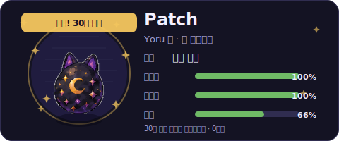

<div align="center">


### *시도는 빠르게, 검증은 집요하게, 코드는 단단하게.*
### *요청과 응답 사이의 빈틈을 줄여가는 백엔드 개발자 임지호입니다.*

</div>
<br/>

## `GET /api/v1/profile/jiho`

```http
HTTP/1.1 200 OK
Content-Type: application/json
```

```json
{
  "name": "JIHO",
  "role": "Backend Developer",
  "about": "while (true) { code(); test(); document(); refactoring(); }",
  "motto": "Fail fast, learn faster, rollback never.",
  "status": "coffee_driven_development"
}
```

<br/>

## `GET /api/v1/skills`

```http
HTTP/1.1 200 OK
Content-Type: application/json
```

<div align="center">


</div>

```json
{
  "language": ["Java"],
  "backend": ["Spring Boot", "REST API"],
  "database": ["MySQL"],
  "devOps": ["Docker", "AWS"],
  "tools": ["Git", "GitHub"]
}
```

<br/>

## `GET /api/v1/contact`

```http
HTTP/1.1 200 OK
Content-Type: application/json
```

<div align="center">

<a href="https://vanilalatte.tistory.com/">
  
</a>
<a href="mailto:jiho4890@gmail.com">
  
</a>

</div>

```json
{
  "blog": "https://vanilalatte.tistory.com/",
  "email": "jiho4890@gmail.com"
}
```

<br/>

## `GET /api/v1/contributions/snake`

```http
HTTP/1.1 200 OK
Content-Type: image/svg+xml
```

<picture>
  <source media="(prefers-color-scheme: dark)" srcset="https://raw.githubusercontent.com/vanilalatte03/vanilalatte03/output/github-contribution-grid-snake-dark.svg?v=3" />
  <source media="(prefers-color-scheme: light)" srcset="https://raw.githubusercontent.com/vanilalatte03/vanilalatte03/output/github-contribution-grid-snake.svg?v=3" />
  
</picture>

<br/>

## `GET /api/v1/commitchi`

```http
HTTP/1.1 200 OK
Content-Type: image/svg+xml
X-Commitchi-Character: #2 nari
```



<div align="center">

<a href="https://github.com/vanilalatte03/vanilalatte03/issues/new?title=commitchi%3A%20feed">
  
</a>
<a href="https://github.com/vanilalatte03/vanilalatte03/issues/new?title=commitchi%3A%20play">
  
</a>

</div>

</div>
